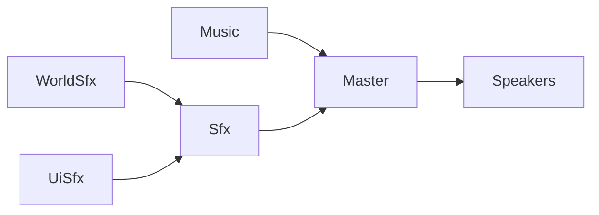

# Fresnel.Audio how-to

## Setup and looping playback

Define the mixer layout used by your game. Bus instances are stable routing objects,
so players remain attached while their settings change.

```csharp
using Fresnel.Audio;

sealed class GameMixer : AudioMixer
{
    public AudioBus Music { get; }
    public AudioBus Sfx { get; }

    public GameMixer() : base(new AudioBus())
    {
        Music = AddBus(nameof(Music), new AudioBus { Volume = -8f });
        Sfx = AddBus(nameof(Sfx), new AudioBus
        {
            Effects =
            {
                new CompressorEffect(),
                new ReverbEffect { Mix = 0.2f }
            }
        });
    }
}
```

Create `Audio` from a Foster `App`, load a stream, create a player on a bus, and start playback:

```csharp
private readonly GameMixer _mixer = new();
private Audio _audio;
private AudioStream _stream;
private AudioPlayer _player;

protected override void Startup()
{
    _audio = new Audio(this);
    using var source = File.OpenRead("Assets/music.ogg");
    _stream = new AudioStream(_audio, source);
    _player = _stream.CreatePlayer(_mixer.Music);
    _player.Looping = true;
    _player.Play();
}

protected override void Shutdown()
{
    _player.Dispose();
    _stream.Dispose();
    _audio.Dispose();
}
```

## Loading audio

`AudioStream` can load encoded audio from a .NET stream, a byte span, or a path in a Foster `StorageContainer`:

```csharp
using var source = File.OpenRead("Assets/music.ogg");
var fromStream = new AudioStream(_audio, source);

var fromBytes = new AudioStream(_audio, encodedBytes);
var fromStorage = new AudioStream(_audio, storage, "Audio/music.ogg");
```

The default `AudioLoadMode.Decoded` decodes supported formats while loading. Use `AudioLoadMode.Encoded` to retain
encoded data until SDL3_mixer needs it. `Duration` contains the stream length
when the source format provides it.

> [!NOTE]
> QOA is always decoded while loading.

## One-shot sounds

An `AudioPlayer` can start more than one voice from the same stream. Set `MaxVoices` to the number of overlapping
instances you want to allow, then call `Play` whenever the sound should fire:

```csharp
private AudioStream _coinStream;
private AudioPlayer _coinPlayer;

protected override void Startup()
{
    // Create Audio and the mixer first.
    using var source = File.OpenRead("Assets/coin.wav");
    _coinStream = new AudioStream(_audio, source);
    _coinPlayer = _coinStream.CreatePlayer(_mixer.Sfx);
    _coinPlayer.MaxVoices = 4;
}

private void PlayCoinSound()
{
    _coinPlayer.Play();
}
```

Each call starts a separate voice, allowing several copies to overlap. Once `MaxVoices` is reached, the next call
stops and reuses the oldest voice. `Pause`, `Resume`, `Seek`, and `Stop` affect every active voice owned by that
player.

## Playback and mixer controls

Player settings affect every voice owned by that player:

```csharp
player.Volume = -6f;             // Values are decibels.
player.PlaybackRate = 1.25f;
player.Looping = true;

player.Pause();
player.Resume();
player.Seek(TimeSpan.FromSeconds(10));
player.Stop();
```

`State` reports the aggregate playback state, while `ActiveVoices` reports how many voices are active. `Position`
reads or moves the most recently started voice; `Seek` moves every active voice. Use `Db.Silence` for complete
silence or `Db.FromLinear` when starting with a linear gain value.

Bus controls affect players routed through that bus:

```csharp
_mixer.Music.Volume = -3f;
_mixer.Music.Pan = -0.5f; // -1 is left, 0 is center, and 1 is right.
_mixer.Music.Muted = false;
_mixer.Music.Solo = true;
```

Muting a bus silences its whole subtree. Use `Solo` to isolate a bus while balancing the mix. Bus pan applies to
non-spatial players; spatial players derive their balance from position.

## Bus routing

`AddBus` routes a new bus directly to `Master` by default. Pass another bus as `routeTo` to create a hierarchy:

```csharp
sealed class GameMixer : AudioMixer
{
    public AudioBus Music { get; }
    public AudioBus Sfx { get; }
    public AudioBus WorldSfx { get; }
    public AudioBus UiSfx { get; }

    public GameMixer() : base(new AudioBus())
    {
        Music = AddBus(nameof(Music), new AudioBus { Volume = -8f });
        Sfx = AddBus(nameof(Sfx), new AudioBus { Volume = -3f });
        WorldSfx = AddBus(nameof(WorldSfx), new AudioBus(), routeTo: Sfx);
        UiSfx = AddBus(nameof(UiSfx), new AudioBus(), routeTo: Sfx);
    }
}
```

This produces the following routes:



Create players on the most specific bus available, such as `WorldSfx` or `UiSfx`. Audio then flows through each
parent bus until it reaches `Master`.

Pass that bus to `CreatePlayer` when assigning a stream to the mixer:

```csharp
var worldPlayer = explosionStream.CreatePlayer(_mixer.WorldSfx);
var uiPlayer = clickStream.CreatePlayer(_mixer.UiSfx);
```

Parent settings affect all their children. For example, muting `Sfx` also mutes `WorldSfx` and `UiSfx`. Effects on
`Sfx` process the combined output of both child buses.

> [!NOTE]
> Routes are fixed when the mixer is created. Applying a new configuration can update settings and effects,
> but cannot add, remove, or reroute buses.

## Effects

Add effects to a bus in the order they should process its audio:

```csharp
_mixer.Sfx.Effects.Add(new CompressorEffect());
_mixer.Sfx.Effects.Add(new EchoEffect
{
    Delay = TimeSpan.FromMilliseconds(120),
    Feedback = 0.35f,
    Damping = 0.5f,
    Mix = 0.25f
});
```

In this example, the compressor runs first and the echo processes its output. Effects on a parent bus run after its
child buses are mixed together. Fresnel also includes chorus, distortion, equalizer, flanger, reverb, and ring
modulation effects.

Effect settings are immutable. Replace an entry to change its settings at runtime:

```csharp
if (_mixer.Sfx.Effects[1] is EchoEffect echo)
{
    _mixer.Sfx.Effects[1] = echo with { Mix = 0.4f };
}
```

Adding, replacing, removing, or clearing effects validates the new collection and prepares new processors before
the audio callback switches to them. Rebuilding resets state such as delay tails and compressor envelopes, so update
the collection only when its configuration actually changes—not every frame.

## Mixer configuration and live updates

Mixer configuration can be represented with ordinary objects containing `AudioBus`
properties and serialized with `System.Text.Json`:

```csharp
sealed class GameMixerConfig
{
    public AudioBus Master { get; init; } = new();
    public AudioBus Music { get; init; } = new() { Volume = -8f };
    public AudioBus Sfx { get; init; } = new();
}
```

Apply a newly loaded or editor-produced configuration to the existing mixer rather than replacing its buses:

```csharp
public void Apply(GameMixerConfig config)
{
    Master.Apply(config.Master);
    Music.Apply(config.Music);
    Sfx.Apply(config.Sfx);
}
```

`AudioBus.Apply` updates volume, pan, mute, solo, and effects. Changed effects are validated and
new processor arrays are prepared before the live audio callbacks switch to them. Existing streams and players keep
their current bus connections.

## Saving and loading mixer configuration

Use a source-generated JSON context with collection population enabled so deserialization fills each bus's existing
`Effects` collection:

```csharp
using System.Text.Json;
using System.Text.Json.Serialization;

[JsonSourceGenerationOptions(
    WriteIndented = true,
    PreferredObjectCreationHandling = JsonObjectCreationHandling.Populate)]
[JsonSerializable(typeof(GameMixerConfig))]
partial class GameJsonContext : JsonSerializerContext;
```

Serialize the configuration edited by your tools, then deserialize and apply it to the live mixer:

```csharp
var json = JsonSerializer.Serialize(config, GameJsonContext.Default.GameMixerConfig);
File.WriteAllText("mixer.json", json);

var loaded = JsonSerializer.Deserialize(
    File.ReadAllText("mixer.json"),
    GameJsonContext.Default.GameMixerConfig)
    ?? throw new JsonException("Could not load the mixer configuration.");

_mixer.Apply(loaded);
```

Persist configuration objects rather than replacing the live mixer. This preserves the bus identities referenced by
existing players.

## Spatial audio

Assign a spatial configuration to a player and update the shared listener from game-world transforms:

```csharp
player.Spatial = new AudioSpatial.Spatial2D(new Vector2(4, 2));
audio.Listener.SetTransform(listenerPosition, listenerRotation);
```

`Spatial2D` maps its XY coordinates to the world's XZ plane.

`Spatial3D` accepts a `Vector3`. Non-spatial players use their bus's stereo pan instead.

## Lifetime and threading

Create `Audio` on Foster's main thread and perform playback control, mixer changes, and effect edits from the
application thread. Fresnel publishes those changes safely to SDL's audio callbacks, which run on a separate thread.

Resources form an ownership hierarchy: `Audio` owns its streams, and each `AudioStream` owns the players created
from it. Disposing a stream also disposes its players; disposing `Audio` disposes every remaining stream and player
before shutting down the audio device. Dispose individual players and streams when they are no longer needed rather
than keeping them alive until application shutdown.
